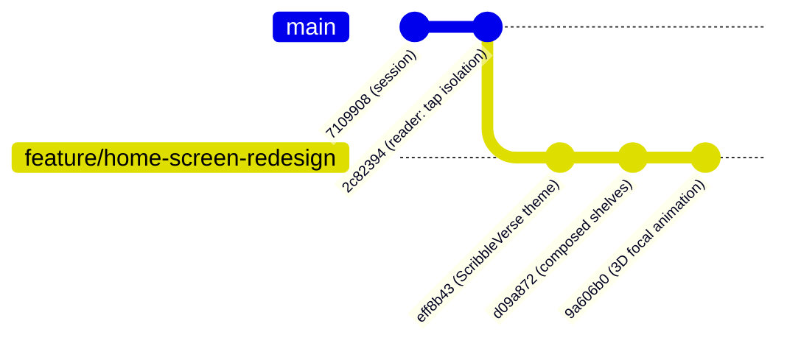

# Git Branching & Version Control Guide

This document outlines the Git branching strategy, commit history, branch management workflows, and release procedures for the **Epub & Audiobooks** project.

---

## 🌳 Branch Architecture



| Branch Name | Status | Description | Head Commit |
| :--- | :--- | :--- | :--- |
| **`main`** | `Production Base` | Stable production branch with reader tap event isolation, word-level audio sync, multi-voice TTS, and OCR. | `2c82394` |
| **`feature/home-screen-redesign`** | `Active Feature` | ScribbleVerse Warm Linen & Dark Ebony redesign, composed shelves, dynamic 3D scroll scaling, and spring micro-animations. | `9a606b0` |

---

## 📜 Key Commit History & Milestones

### 🎨 Home Screen Redesign (`feature/home-screen-redesign`)
* **`9a606b0`** - `feat(ui): add dynamic scroll-driven focal scaling, 3D perspective tilt and book spine depth shadows to horizontal shelves`
  - Added live dynamic focal scaling (`1.0x` focus with glowing aura vs `0.91x` off-focus).
  - Added 3D perspective rotation tilt on horizontal drag.
  - Added authentic book spine depth gradient shadow on covers.
* **`d09a872`** - `feat(ui): compose library shelves into clean, compact collections and eliminate infinite vertical stacking`
  - Reorganized home into 2–3 streamlined shelves (Continue Reading, Malayalam Literature, World Classics, Your Imports).
  - Transformed top chips into real-time interactive collection filters.
  - Reduced shelf card dimensions (`258px → 232px`) to eliminate scroll fatigue.
* **`eff8b43`** - `feat(ui): implement ScribbleVerse warm linen & ebony design with micro-animations`
  - Warm parchment / linen theme (`#F3ECE0` light, `#16120E` dark).
  - Small-caps serif typography and floating dark capsule bottom navigation bar.
  - Spring-scale micro-interactions (`_TappableScale`).

### 📚 Core Reader & Audio Engines (`main`)
* **`2c82394`** - `feat(reader): isolate tap events in reading view and refine word boundary highlight expansion`
* **`7109908`** - `feat(session): integrate multi-voice narrator, seamless paragraph playback, and acoustic word synchronization`
* **`fd26f70`** - `feat(audio): extend audio engine with voice switching, speech rate calibration, and completion handling`
* **`10d8cae`** - `feat(synchronization): add sync engine for reading position and audio segment tracking`
* **`a9ad5c0`** - `feat(voice): implement multi-voice architecture with character profiles, speaker detection, and audio caching`
* **`b026cf9`** - `fix(ui): add scrollable quick action bar on home screen and adjust reader content insets`
* **`c91c7b8`** - `feat(intent): add Android OS text share and send intent handling`
* **`84ad851`** - `feat(text_content): add in-app writing, clipboard paste, normalization, and Hive storage`
* **`e35d60c`** - `feat(theme): implement app-wide dark mode with synchronized reader and audio player themes`
* **`aba5010`** - `feat: add multi-language OCR scan, full chapter & book translation with dynamic TTS voice switching`
* **`fc982da`** - `feat(pdf): add full PDF support with reflowable TTS reader and distinct EPUB/PDF visual differentiations`
* **`583e5c8`** - `feat(notification): align phone notification bar with home screen player tile and add documentation`

---

## 🛠️ Common Git Workflows

### 1. Checking Status & Switching Branches
```bash
# Check current active branch and working directory status
git status

# Switch to the stable main branch
git checkout main

# Switch to the redesign feature branch
git checkout feature/home-screen-redesign
```

### 2. Merging the Redesign into `main` (When Ready)
When you are satisfied with the new design and want to make it the default on `main`:
```bash
# 1. Switch to main
git checkout main

# 2. Merge the feature branch
git merge feature/home-screen-redesign

# 3. Verify tests and build
flutter test
flutter build apk --release
```

### 3. Reverting to Previous Commits (Rollback)
If you ever want to test or revert to a specific previous commit:
```bash
# Temporarily inspect an older commit (detached HEAD)
git checkout 2c82394

# Return to your active branch
git checkout feature/home-screen-redesign
```

### 4. Creating a New Feature Branch
```bash
# Create and switch to a new branch from your current position
git checkout -b feature/my-new-feature
```

---

## 📱 Building & Installing Release APKs

From any active branch:

```bash
# 1. Run static analysis & test suite
flutter analyze
flutter test

# 2. Build release APK
flutter build apk --release

# 3. Install to connected device via ADB
adb install -r build/app/outputs/flutter-apk/app-release.apk
```

**Output Artifact Location**:
`build/app/outputs/flutter-apk/app-release.apk`
