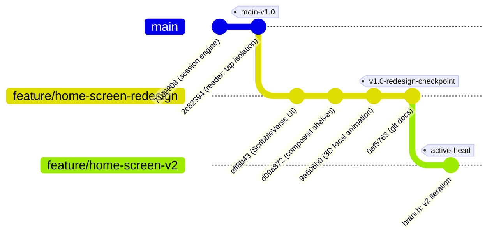
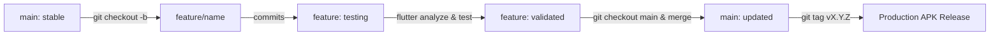

# Git Branching & Version Control Guide

This document outlines the complete Git branching model, repository architecture, commit history, branch management workflows, and release procedures for the **Epub & Audiobooks** project.

---

## 🌳 Repository Branching Structure & Model

The project adheres to a streamlined **Feature Branching / GitHub Flow** model optimized for Flutter mobile development. Production releases remain strictly stable on `main`, while UI redesigns, audio engine additions, and experimental features are developed in isolated branches.



---

## 🌲 Visual Branch Hierarchy & Commit Graph

```text
========================================================================================
                               GIT BRANCH HIERARCHY
========================================================================================

 [main] ── (Production Stable Base: 2c82394)
   │
   ├─► 2c82394: feat(reader): isolate tap events & word boundary highlight expansion
   ├─► 7109908: feat(session): multi-voice narrator, paragraph playback & word sync
   ├─► fd26f70: feat(audio): voice switching, speech rate calibration & completion
   ├─► 10d8cae: feat(synchronization): reading position & audio segment tracking
   ├─► a9ad5c0: feat(voice): multi-voice architecture & character speaker profiles
   ├─► b026cf9: fix(ui): scrollable quick action bar & reader content insets
   ├─► c91c7b8: feat(intent): Android OS text share and send intent handling
   ├─► 84ad851: feat(text_content): in-app writing, clipboard paste & Hive storage
   ├─► e35d60c: feat(theme): app-wide dark mode & synchronized reader/player themes
   ├─► aba5010: feat(ocr): multilingual OCR scan & dynamic TTS voice switching
   └─► fc982da: feat(pdf): reflowable PDF reader with distinct format badges
         │
         │ (Branch point: git checkout -b feature/home-screen-redesign)
         ▼
 [feature/home-screen-redesign] ── (Preserved Checkpoint: 0ef5763)
   │   • ScribbleVerse Warm Linen & Dark Ebony Theme (#F3ECE0 / #2B2620)
   │   • 3D Horizontal Focal Perspective Tilt & Spine Shadows
   │   • Composed Smart Collections (Malayalam, Classics, Imports) & Filter Chips
   │   • Floating Dark Capsule Bottom Navigation Bar
   │
   └──► (Branch point: git checkout -b feature/home-screen-v2)
         │
         ▼
 [feature/home-screen-v2] ── (ACTIVE EXPERIMENT BRANCH 🚀)
       • Clean sandbox created directly from feature/home-screen-redesign
       • Safe to try new layouts, palettes, animations, and concepts
       • Can switch back to feature/home-screen-redesign anytime
```

---

## 📊 Branch Matrix & Feature Comparison

| Attribute | `main` | `feature/home-screen-redesign` | `feature/home-screen-v2` *(Active)* |
| :--- | :--- | :--- | :--- |
| **Branch Purpose** | Core engine stability | Preserved ScribbleVerse checkpoint | Active sandbox for new design exploration |
| **Status** | Stable base (`2c82394`) | Preserved intact (`0ef5763`) | Active working branch 🚀 |
| **Aesthetic Theme** | Clean Material 3 standard | ScribbleVerse Warm Linen (`#F3ECE0`) | Custom / New Design Experimentation |
| **Shelf Architecture** | Stacked format shelves | Composed Smart Collections | Ready for new layout ideas |
| **Scroll Animation** | Standard linear scroll | Dynamic 3D Focal Scaling (`Matrix4`) | Customizable |
| **Test Suite Status** | 92 / 92 Passed ✅ | 92 / 92 Passed ✅ | 92 / 92 Passed ✅ |
| **Static Analysis** | 0 Issues ✅ | 0 Issues ✅ | 0 Issues ✅ |

---

## 🏷️ Branch Types & Naming Conventions

When developing new features, fixes, or experiments, adhere to this naming taxonomy:

| Branch Pattern | Purpose | Base Branch | Merge Target | Lifecycle |
| :--- | :--- | :--- | :--- | :--- |
| `main` | Production-ready, fully tested releases | N/A | Production Deploy | Permanent |
| `feature/<name>` | New capabilities, UI revamps, or UX flows | `main` | `main` | Deleted after merge |
| `bugfix/<name>` | Non-critical bug repairs & edge-case handling | `main` | `main` | Deleted after merge |
| `hotfix/<name>` | Urgent production patches | `main` | `main` | Deleted after merge |
| `experiment/<name>` | Exploratory prototypes or performance spikes | `main` | Optional merge | Temporary |
| `release/v<X.Y.Z>` | Release staging, freeze, and final QA | `main` | `main` (with tag) | Deleted after tag |

---

## 🔄 Branch Lifecycle & Workflow Procedures



### 1. Inspecting Branch Status
```bash
# List all local branches with active branch highlighted
git branch -v

# View full commit graph across all branches in terminal
git log --graph --oneline --all --decorate -n 15
```

### 2. Switching Between Branches
```bash
# Switch to the stable main base
git checkout main

# Switch to the redesigned feature branch
git checkout feature/home-screen-redesign
```

### 3. Creating a New Feature Branch
```bash
# Always branch off a clean, up-to-date main
git checkout main
git checkout -b feature/audio-dsp-equalizer

# Make changes and commit with conventional commits
git add .
git commit -m "feat(audio): add 5-band equalizer and bass boost presets"
```

### 4. Merging a Feature Branch into `main`
When the feature is complete and verified:
```bash
# 1. Switch to main
git checkout main

# 2. Merge with explicit merge commit preserving history
git merge --no-ff feature/home-screen-redesign -m "Merge branch 'feature/home-screen-redesign' into main"

# 3. Run automated verification suite
flutter analyze
flutter test

# 4. Build production APK
flutter build apk --release
```

### 5. Hotfix Workflow
For urgent patches directly onto production:
```bash
git checkout main
git checkout -b hotfix/tts-null-pointer

# Apply fix and commit
git commit -am "fix(tts): guard against uninitialized audio track on lock screen"

# Merge back into main
git checkout main
git merge --no-ff hotfix/tts-null-pointer
git tag -a v1.0.1 -m "Release v1.0.1 hotfix"
```

### 6. Cleaning Up Completed Branches
```bash
# Delete local feature branch after merging
git branch -d feature/home-screen-redesign

# Force delete an unmerged experimental branch
git branch -D experiment/discarded-concept
```

---

## 📜 Complete Repository Commit Log

### 🎨 Home Screen Redesign (`feature/home-screen-redesign`)
* **`6827fde`** - `docs: add GIT.md with branch guide, commit history, and release workflows`
* **`9a606b0`** - `feat(ui): add dynamic scroll-driven focal scaling, 3D perspective tilt and book spine depth shadows to horizontal shelves`
  - Dynamic focal zoom (`1.0x` focus with warm glow vs `0.91x` off-focus).
  - 3D perspective rotation tilt on horizontal drag.
  - Authentic book spine depth gradient shadow on all covers.
* **`d09a872`** - `feat(ui): compose library shelves into clean, compact collections and eliminate infinite vertical stacking`
  - Reorganized home into 2–3 streamlined shelves (Continue Reading, Malayalam Literature, World Classics, Your Imports).
  - Transformed top chips into real-time interactive collection filters.
  - Reduced shelf card dimensions (`258px → 232px`) to eliminate scroll fatigue.
* **`eff8b43`** - `feat(ui): implement ScribbleVerse warm linen & ebony design with micro-animations`
  - Warm parchment / linen theme (`#F3ECE0` light, `#16120E` dark).
  - Small-caps serif typography and floating dark capsule bottom navigation bar.
  - Spring-scale micro-interactions (`_TappableScale`).

### 📚 Core Engine Milestones (`main`)
* **`2c82394`** - `feat(reader): isolate tap events in reading view and refine word boundary highlight expansion`
* **`7109908`** - `feat(session): integrate multi-voice narrator, seamless paragraph playback, and acoustic word synchronization`
* **`fd26f70`** - `feat(audio): extend audio engine with voice switching, speech rate calibration, and completion handling`
* **`10d8cae`** - `feat(synchronization): add sync engine for reading position and audio segment tracking`
* **`a9ad5c0`** - `feat(voice): implement multi-voice architecture with character profiles, speaker detection, and audio caching`
* **`b026cf9`** - `fix(ui): add scrollable quick action bar on home screen and adjust reader content insets`
* **`c91c7b8`** - `feat(intent): add Android OS text share and send intent handling`
* **`84ad851`** - `feat(text_content): add in-app writing, clipboard paste, normalization, and Hive storage`
* **`e35d60c`** - `feat(theme): implement app-wide dark mode with synchronized reader and audio player themes`
* **`aba5010`** - `feat: add multi-language OCR scan, full chapter & book translation with dynamic TTS voice switching`
* **`fc982da`** - `feat(pdf): add full PDF support with reflowable TTS reader and distinct EPUB/PDF visual differentiations`
* **`583e5c8`** - `feat(notification): align phone notification bar with home screen player tile and add documentation`

---

## 📱 Release APK Compilation & Verification

To verify and package the application on any branch:

```bash
# 1. Static Analysis (Zero warning policy)
flutter analyze

# 2. Automated Test Suite (92 Unit & Widget Tests)
flutter test

# 3. Production Release APK Compilation
flutter build apk --release

# 4. Direct Device Installation via ADB
adb install -r build/app/outputs/flutter-apk/app-release.apk
```

**Binary Output Location**:
[`build/app/outputs/flutter-apk/app-release.apk`](file:///Users/admin/epub_audio/build/app/outputs/flutter-apk/app-release.apk)
